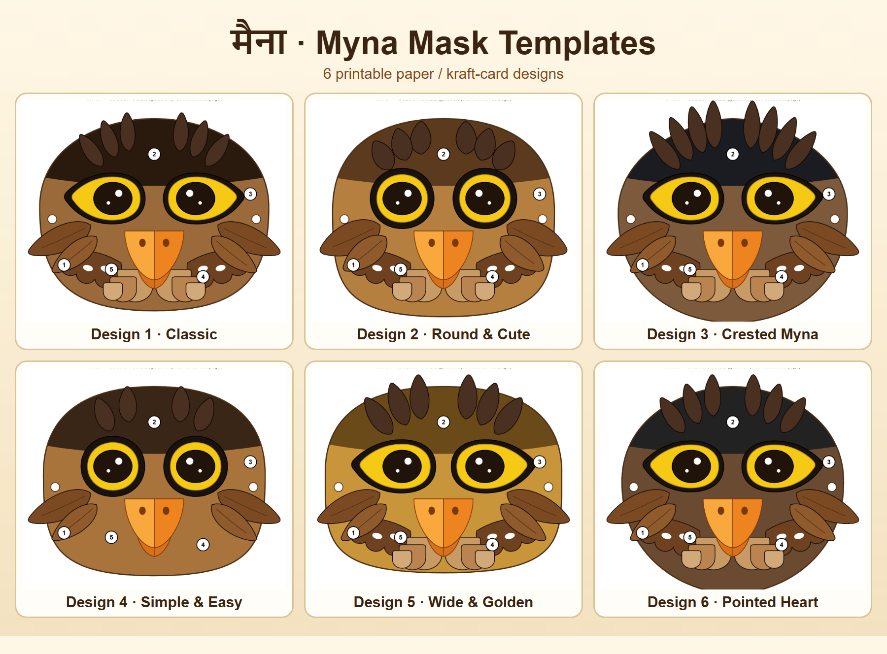
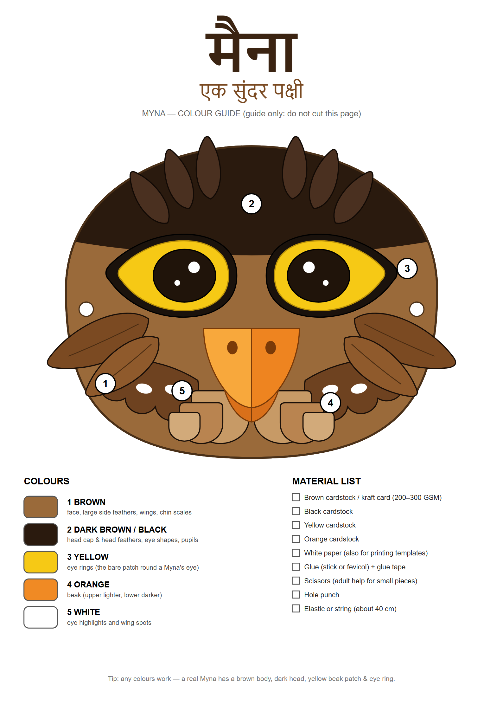
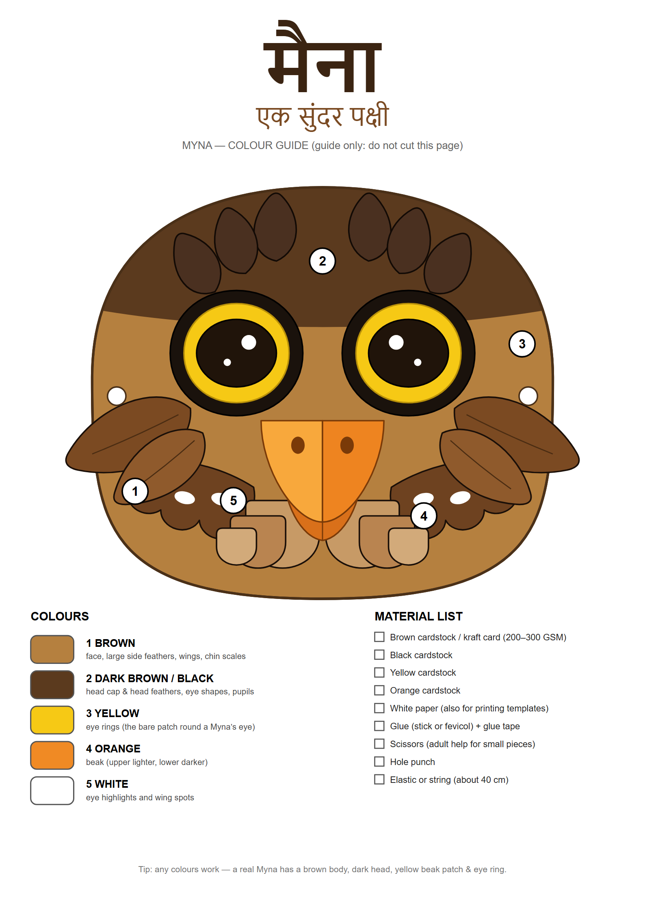
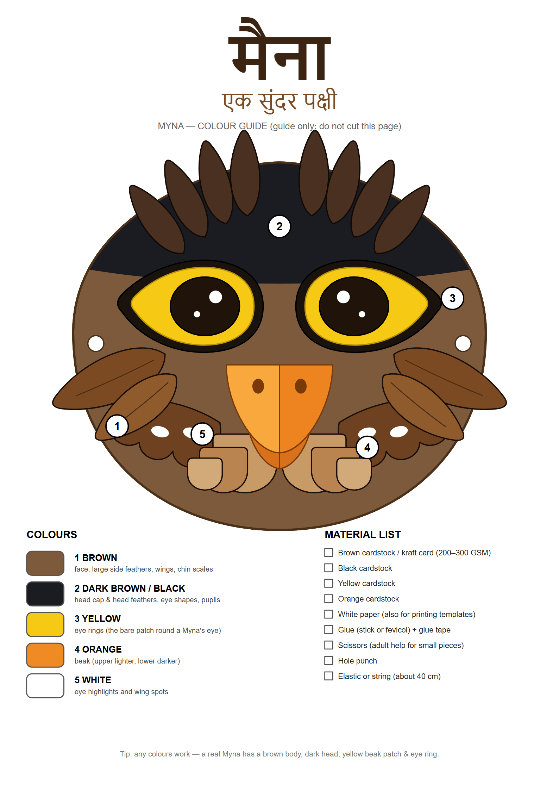
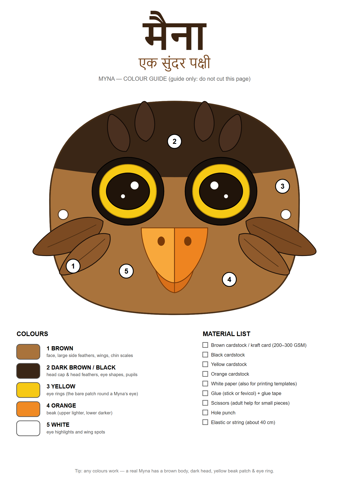
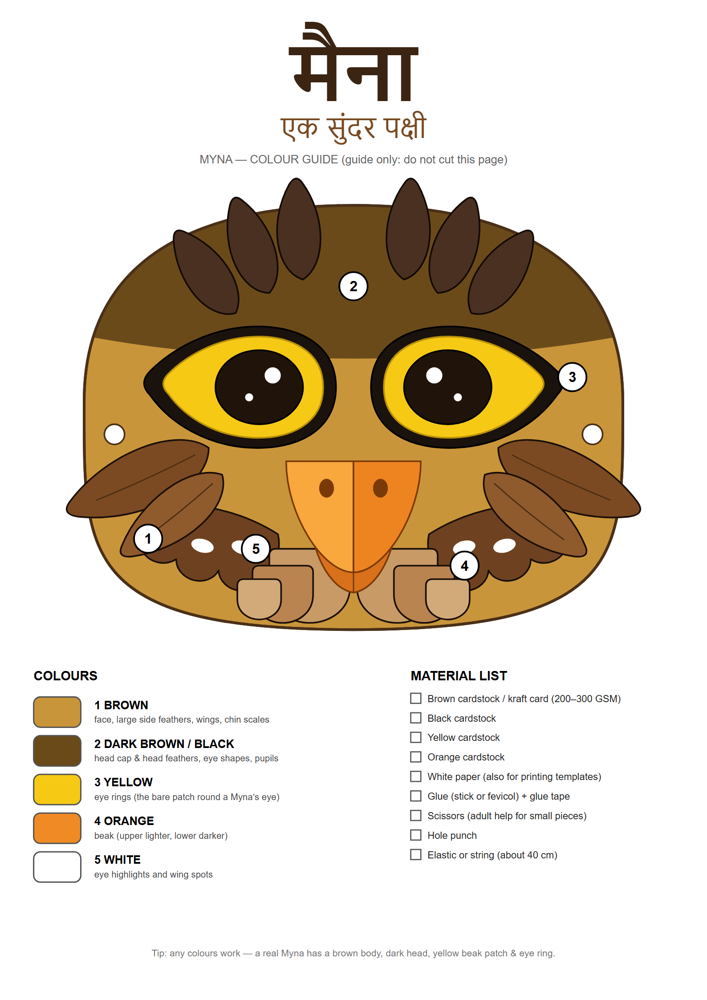
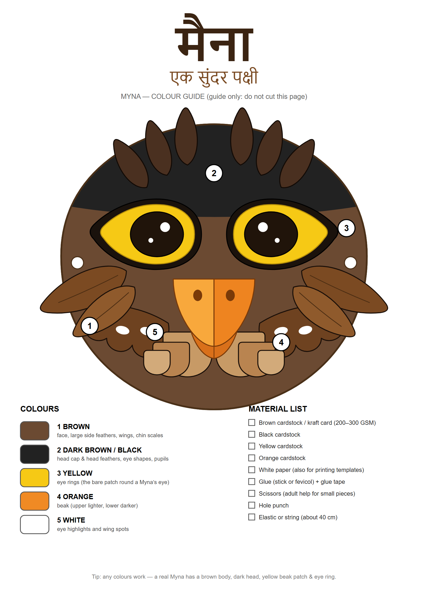
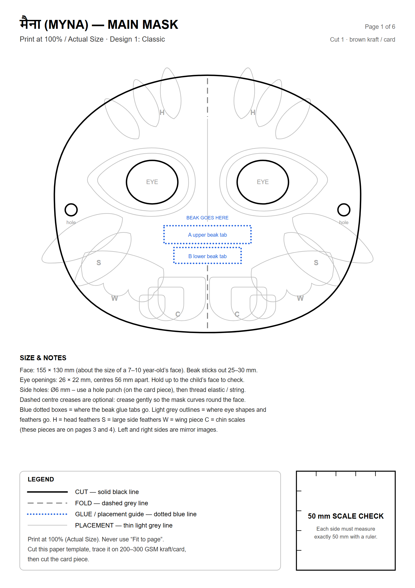
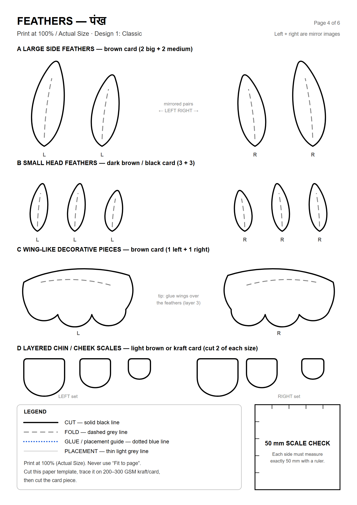
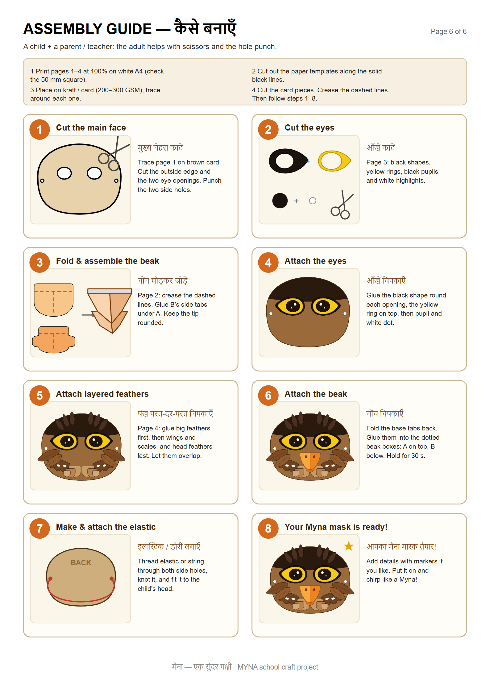

<div align="center">

# मैना · Myna Mask Templates

### Printable paper / kraft-card bird mask for school projects

**6 designs · 36 A4 SVG pages · print, trace, cut, glue**



[](LICENSE)


</div>

---

## What is this?

Complete, ready-to-print **cutting templates** for a cute Indian Myna (मैना) face mask — not just pictures.
You print the pages on normal white A4, cut the paper templates out, **trace them onto kraft / card paper (200–300 GSM)**, cut again, and glue up a slightly 3D, layered bird mask.

Every design comes with the same six pages:

| # | Page | What it is |
|---|------|-----------|
| 1 | `01_main_mask.svg` | Main face with eye openings, elastic holes, beak-glue boxes and feather placement guides |
| 2 | `02_beak.svg` | Folding 3D beak (upper + lower), glue tabs, fold lines, assembly numbers |
| 3 | `03_eyes.svg` | Black eye shapes, yellow eye rings, pupils in several sizes, white highlights |
| 4 | `04_feathers.svg` | Large side feathers, head feathers, wing pieces, layered chin scales (left/right mirrored) |
| 5 | `05_colour_guide.svg` | Finished-mask colour guide + material list *(not for cutting)* |
| 6 | `06_assembly_guide.svg` | 8-step picture instructions in English + हिन्दी *(not for cutting)* |

---

## The six designs

| | Design | Look | Face size |
|---|---|---|---|
|  | **1 · Classic** | Broad face, dark cap, fan of head feathers | 155 × 130 mm |
|  | **2 · Round & Cute** | Big round "googly" eyes, chubby head tufts, kraft brown | 150 × 134 mm |
|  | **3 · Crested Myna** | Tall peaked face with a long feather crest | 155 × 138 mm |
|  | **4 · Simple & Easy** | Fewest pieces (no wings/scales) — best for ages 6–8 | 150 × 128 mm |
|  | **5 · Wide & Golden** | Wide face, golden-kraft colours, big feathers | 160 × 126 mm |
|  | **6 · Pointed Heart** | Heart-shaped pointed face, dark brown & black | 150 × 140 mm |

Folders: `Design_1_Classic/`, `Design_2_Round_Cute/`, `Design_3_Crested_Myna/`, `Design_4_Simple_Easy/`, `Design_5_Wide_Golden/`, `Design_6_Pointed_Heart/`.

---

## Preview of the pages (Design 1)

<table>
<tr>
<td align="center"><br><b>Page 1 – Main mask</b></td>
<td align="center"><br><b>Page 4 – Feathers</b></td>
<td align="center"><br><b>Page 6 – Assembly</b></td>
</tr>
</table>

---

## How to make it

1. **Print at 100% / "Actual size"** — never "Fit to page". Pages 1–4 have a **50 mm SCALE CHECK** square: measure it with a ruler; each side must be exactly 50 mm.
2. **Cut out** the paper templates along the solid black lines.
3. **Trace** each template on kraft / card (brown, black, yellow, orange) and cut the card pieces.
4. **Crease** the dashed lines, **glue** the dotted-blue tabs, and follow the 8 steps on page 6:
   cut face → cut eyes → fold beak → attach eyes → layer feathers → attach beak → add elastic → done!

### Line key (printed on every template page)

| Line | Meaning |
|------|---------|
| ━━ solid black (0.7 mm) | **CUT** |
| ╌╌ dashed grey | **FOLD** |
| ┈┈ dotted blue | **GLUE** / placement guide |
| ── thin light grey | **PLACEMENT** guide |

### Materials

- Brown, black, yellow and orange cardstock / kraft card (200–300 GSM)
- White paper (to print the templates)
- Glue (stick or fevicol) + glue tape
- Scissors (adult help for small pieces) and a hole punch
- Elastic or string, about 40 cm

---

## Technical details

- Every page is exactly **A4: 210 × 297 mm**, `viewBox="0 0 210 297"`, units = millimetres.
- Pure vector paths — no raster images, no external fonts or files. Opens in Chrome, Inkscape, Illustrator.
- Eye openings 26 × 22 mm, centres 56 mm apart; elastic holes Ø 6 mm; beak sticks out 25–30 mm.
- Left/right pieces are true mirror images; glue tabs are 8–9 mm deep; all corners and the beak tip are rounded.
- Hindi text uses your system fonts (Nirmala UI / Noto Sans Devanagari / Mangal).
- Checked automatically: all pages A4, nothing outside the page, no overlapping cut pieces, scale square = 50.0 mm.

---

## Customise it

All dimensions and the design variants live at the top of [`generate_templates.py`](generate_templates.py) (millimetres):

```bash
python generate_templates.py      # regenerates every Design_* folder
```

Add your own design by adding an entry to the `DESIGNS` dictionary (face width/height, face roundness, colours, feather sizes and placements, eye style).

---

## Project layout

```
MynaMask/
├── Design_1_Classic/ … Design_6_Pointed_Heart/   # 6 SVG pages each
├── images/                                        # PNG previews used in this README
├── generate_templates.py                          # generator for every page
├── LICENSE
└── README.md
```

---

## License

[MIT](LICENSE) — free for schools, teachers and parents. Happy crafting! 🐦
